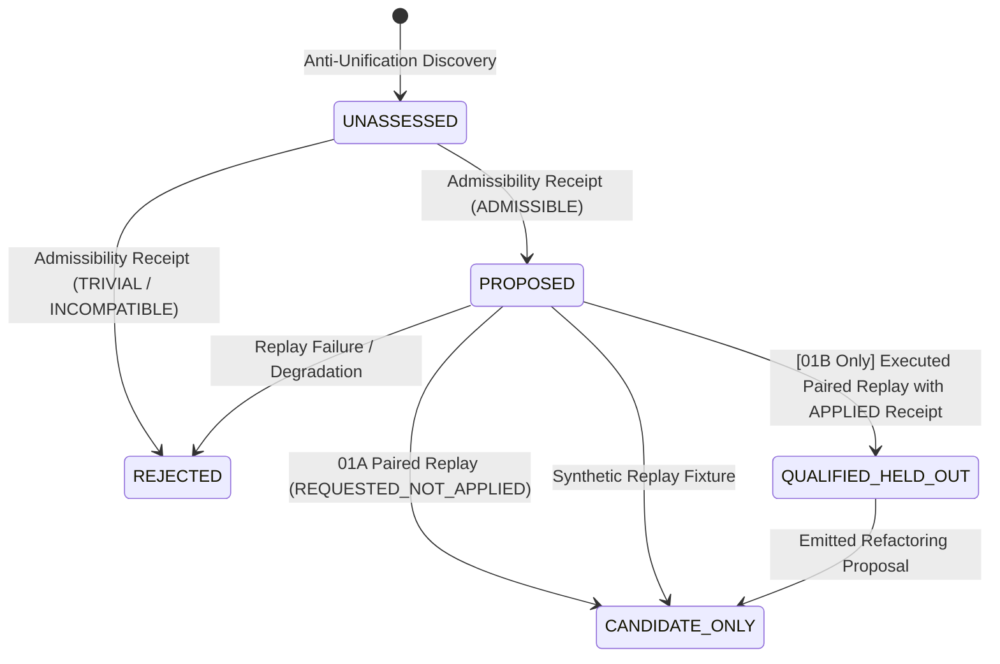

# Automated Abstraction & Anti-Unification Model

**Work Order**: `WO-MATH-FORMAL-DISCOVERY-01A-R4-R1`
**Module**: `msk-formal-discovery/docs/ABSTRACTION_MODEL.md`
**Final Disposition**: `FORMAL_DISCOVERY_SPINE_ACCEPTED`

---

## 1. Problem Formulation

Automated abstraction is the algorithmic process of identifying recurring structural reasoning fragments across execution traces and generalizing them into parameterized, reusable components.

The engine requires that abstraction candidates satisfy three criteria:
1. **Syntactic Generalization**: Structural anti-unification must produce a well-formed Least General Generalization (LGG) with verifiable substitution witnesses and pass all admissibility guards.
2. **Held-Out Generalization**: The candidate must accelerate problem resolution or compress search representations on strictly disjoint problem instances ($\text{DISCOVERY\_PROBLEM\_DIGESTS} \cap \text{QUALIFICATION\_PROBLEM\_DIGESTS} = \emptyset$).
3. **Multi-Metric Measured Benefit**: Proof length compression alone is insufficient. A valid candidate must demonstrate observed branch pruning, node expansion reduction, or wall-time improvement under real paired replay.

---

## 2. Term Representation Terminology & Type Status

> [!IMPORTANT]
> **IR Typing Status: `UNTYPED FIRST_ORDER_STRUCTURAL_AST`**
> Current Term IR is strictly an **untyped first-order structural abstract syntax tree**. It does **not** implement:
> - Higher-Order Logic (HOL)
> - Dependent Type Theory (DTT)
> - Lambda Calculus with Subtyping
>
> Symbol names and application heads encode tree structure and syntactic arity without intrinsic logical typing. Type safety and domain semantics are enforced externally through admissibility guards and backend execution checkers.

Reasoning steps, tactic invocations, and expressions are modeled in the first-order AST:
- **`Const(name)`**: Named atomic symbols, constants, and operators.
- **`Var(name)`**: Generalization variables ($V_1, V_2, \dots$) bound by substitutions.
- **`App(fn, args)`**: Function applications and composite sequence steps.

Terms support canonical string formatting, variable substitution (`term.substitute(subst)`), and deterministic SHA-256 digesting (`term.digest()`).

---

## 3. Structural Anti-Unification Algorithm

The anti-unifier implements Gordon Plotkin's Least General Generalization (LGG) algorithm extended to multi-trace reasoning sequences:

$$\text{LGG}(t_1, t_2, \dots, t_N)$$

### 3.1 Algorithm Rules
1. **Identical Subterms**: If $t_1 = t_2 = \dots = t_N$, return $t_1$.
2. **Matching Application Heads**: If all $t_i = f(u_{i,1}, \dots, u_{i,k})$, return:
   $$f\left(\text{LGG}(u_{1,1}, \dots, u_{N,1}), \dots, \text{LGG}(u_{1,k}, \dots, u_{N,k})\right)$$
3. **Repeated Difference Pairs**: If the tuple of subterms $(t_1, \dots, t_N)$ has already been observed in the current derivation, reuse the existing variable $V_j$.
4. **Variable Allocation**: Otherwise, allocate a deterministic fresh variable $V_{m+1}$ and record the substitution witness:
   $$\sigma_i(V_{m+1}) = t_i \quad \forall i \in \{1, \dots, N\}$$

### 3.2 Reconstruction Invariant
Before any candidate is emitted, the engine verifies the reconstruction identity:
$$\text{LGG}(t_1, \dots, t_N)\sigma_i = t_i \quad \forall i \in \{1, \dots, N\}$$
Failure to reconstruct raises `AntiUnificationError`.

### 3.3 Admissibility Evaluation & Attested Receipts

Every newly generated candidate defaults to:
$$\text{admissibility\_status} \equiv \text{"UNASSESSED"}$$

Admissibility must be formally evaluated, generating an attested [`AdmissibilityReceipt`](file:///home/kowen9024/repos/msk-formal-discovery/schemas/admissibility-receipt.v0.1.schema.json). Candidates with `UNASSESSED` admissibility are prohibited from held-out qualification.

The receipt requires:
- Cryptographic binding to candidate, anti-unifier version, and evaluation timestamp.
- Recomputed verification that `lgg_term_digest == lgg.digest()` and each input term digest matches the original term digests.
- Count of meaningful shared constructor symbols ($\ge 1$).

The kernel evaluates terms against strict structural guards:
1. **Trivial Variable Guard (`STRUCTURAL_GENERALIZATION_TRIVIAL`)**:
   If the computed LGG term collapses to a bare variable $\text{Var}(V)$, all structural information has been lost. Such terms are rejected (`is_trivial_variable = True`).
2. **Vacuous Wrapper Guard**:
   Wrapper-only terms like `seq(V1)` or `sequence(V1)` possessing zero non-wrapper meaningful constructors are rejected as trivial generalization.
3. **Semantic Domain Incompatibility Guard (`TRIVIAL_OR_SEMANTICALLY_INCOMPATIBLE_GENERALIZATION`)**:
   Generalizations crossing incompatible mathematical domains (e.g. integer addition `int_plus` with boolean XOR `bool_xor`) are rejected as mathematically un-typed and non-generalizable.
4. **Branch-Local Pattern Guard (`REQUIRES_BRANCH_GUARD`)**:
   Patterns discovered within specific branching contexts cannot be exported globally without explicit branch precondition guards.
5. **Non-Globalizable Patterns (`NON_GLOBALIZABLE`)**:
   Patterns tied to contradictory premise sets cannot be ratcheted into global lemma repositories.

---

## 4. Subtrace Mining & Automatic Discovery-Unit Derivation

The [`SubtraceMiner`](file:///home/kowen9024/repos/msk-formal-discovery/src/msk_formal_discovery/abstraction/subtrace_miner.py) discovers recurring n-gram sequences:
1. Slices successful proof paths via `TraceNormalizer.slice_successful_path`.
2. Strips lifecycle framing events (`INITIAL_PROBLEM`, `TERMINAL_VERDICT`, `RESOURCE_OBSERVATION`).
3. **Excludes Caller Tactics & Synthetic Traces**: In production mode (`synthetic_algorithm_test_mode=False`), events tagged with `event_origin == EventOrigin.CLIENT_DECLARED` or originating from `SYNTHETIC_FIXTURE` are strictly excluded from mining. Only genuinely executed `BACKEND_OBSERVED` events are eligible for abstraction.
4. Extracts contiguous operation sub-sequences of length $L \in [\text{min\_length}, \text{min\_length} + 4]$.
5. Evaluates support across distinct trace IDs and canonical `problem_digests`. Subtraces appearing in $\ge \text{min\_support}$ distinct traces are fed to the anti-unifier.
6. Candidates retain explicit `discovery_origin` (`EXECUTED_SEARCH_MINING`, `CLIENT_DECLARED_MINING`, `SYNTHETIC_FIXTURE`) and `qualification_problem_ids`.

### 4.1 Automatic Discovery-Unit Derivation (`CandidateFactory.from_pattern`)
Under `WO-MATH-FORMAL-DISCOVERY-01A-R4-R1`:
- `discovery_problem_digests` and `source_trace_digests` are derived automatically by projecting over source trace IDs in deterministic order:
  $$\text{discovery\_problem\_digests} = [\text{trace\_problem\_digests}[t] \text{ for } t \in \text{source\_trace\_ids}]$$
  $$\text{source\_trace\_digests} = [\text{trace\_digests}[t] \text{ for } t \in \text{source\_trace\_ids}]$$
- The previous dictionary key-extraction regression is permanently eliminated.
- **Fail-Closed Missing Identity**: Any trace missing a valid 64-char lowercase hex `problem_digest` or `trace_digest` immediately raises `AbstractionCandidateError` (`MISSING_SOURCE_PROBLEM_DIGEST`, `MISSING_SOURCE_TRACE_DIGEST`).
- **Caller Override Rejection**: If the caller passes explicit discovery digests that conflict with the automatically derived trace digests, the factory fails closed with `CALLER_DISCOVERY_DIGEST_MISMATCH`.

---

## 5. De-Fabricated Held-Out Replay, Application Boundary Freeze, & Paired Contracts

### 5.1 Prohibition of Fabricated Benefit Formulas & Positive Benefit Claims
Predetermined improvement formulas (`baseline * 0.7`) are strictly prohibited. All qualification metrics must be **empirically observed** from search execution receipts or explicitly marked synthetic.
Furthermore, under `WO-MATH-FORMAL-DISCOVERY-01A-R4-R1`, positive abstraction benefit claims are strictly **PROHIBITED** in 01A.

### 5.2 Digest-Complete Paired Replay Contract
For every held-out problem instance, a [`PairedReplayContract`](file:///home/kowen9024/repos/msk-formal-discovery/src/msk_formal_discovery/abstraction/replay.py) binds identical execution variables:
- Canonical `problem_digest` (64-char lowercase hex)
- Attested `environment_digest` (64-char lowercase hex)
- Attested `backend_digest` (64-char lowercase hex)
- Attested `source_graph_digest` (64-char lowercase hex)
- Attested `search_policy_digest` (64-char lowercase hex)
- Attested `initial_state_digest` (64-char lowercase hex)
- Attested `transition_model_id` and `transition_model_digest` (64-char lowercase hex)
- Attested `search_policy_implementation_digest` (64-char lowercase hex)
- Identical search budget and random seed
- Identical corpus context

The contract computes a SHA-256 `contract_digest` enforcing:
$$\text{ALL NON-ABSTRACTION VARIABLES IDENTICAL}$$
Any configuration drift between baseline and candidate-requested arms raises `PairedReplayViolationError`.

### 5.3 Replay Run Receipts & Search-Bundle Bridge
Replay runs produce attested receipts validating against [`schemas/replay-run-receipt.v0.1.schema.json`](file:///home/kowen9024/repos/msk-formal-discovery/schemas/replay-run-receipt.v0.1.schema.json). Receipts verify:
- Exact contract digest match
- Consistency between search run metrics and receipt metrics
- Disjointness between discovery problem digests and qualification problem digests
- **Candidate Application State in 01A**: `DISABLED` on baseline arm, `REQUESTED_NOT_APPLIED` on candidate-requested arm.
- Any caller attempt to assert `candidate_application_status == "APPLIED"` is rejected with `AuthorityViolationError`.
- Factory-bound creation via `ReplayRunReceipt.from_search_execution_bundle(bundle, ...)` consuming verified `SearchExecutionBundle` instances.
- Terminal success evaluation using canonical `is_successful_terminal(status)`.

### 5.4 Candidate Application Authority Closure & Qualification Gating

1. **`SYNTHETIC_REPLAY_FIXTURE`**:
   - Uses fixture data or synthetic runs (`FIXTURE_EVIDENCE_REGISTRY`).
   - Authority is strictly `NONE`.
   - Cannot qualify candidate into `QUALIFIED_HELD_OUT` (leaves status at `CANDIDATE_ONLY`).
   - Cannot establish functional search benefit.
2. **`EXECUTED_SEARCH_RUN` / `CERTIFIED_SEARCH_REPLAY` in 01A**:
   - Genuinely executes search across held-out instances under paired replay contracts.
   - Requires valid runtime HMAC `SearchExecutionWitness`. Caller-constructed replay receipts are rejected (`CALLER_CONSTRUCTED_REPLAY_RECEIPT != EXECUTED_REPLAY_EVIDENCE`).
   - Requires candidate `discovery_origin == "EXECUTED_SEARCH_MINING"`.
   - **Retraction of 01A Qualification**: Because 01A search execution does not mutate search behavior and emits `REQUESTED_NOT_APPLIED` (not `APPLIED`), 01A cannot qualify candidates as `QUALIFIED_HELD_OUT`. All candidate-requested paired replay runs in 01A remain at `CANDIDATE_ONLY`.
   - `functional_search_benefit` exported to ONTO is strictly `UNTESTED`.
   - `QUALIFIED_HELD_OUT` is frozen and reserved for future 01B work orders.

### 5.5 Candidate Digests & Invariants

1. **Candidate Artifact Digest (`compute_candidate_artifact_digest`)**:
   Deterministic SHA-256 digest binding:
   - `candidate_id`
   - `candidate_kind`
   - Canonical `formal_specification`
   - `lgg_term_digest`
   - `admissibility_receipt_digest`
   Available via `AbstractionCandidate.artifact_digest()` or standalone helper.
2. **Candidate Application Digest (`compute_candidate_application_digest`)**:
   Deterministic SHA-256 digest binding:
   - `candidate_application_status`
   - `candidate_id` (or `None`)
   - `candidate_artifact_digest` (or `CANONICAL_DISABLED_APPLICATION_DIGEST`)
   - Attribution statement:
     $$\text{REQUEST\_DIGEST} \neq \text{APPLICATION\_PROOF}$$

### 5.6 Process-Local Witness Trust Note

> [!CAUTION]
> **Process-Local Provenance Witness $\neq$ Hostile Code Isolation**
> `SearchExecutionWitness` provides tamper-evident receipt binding and enforces factory-bound provenance against accidental bypass or caller-constructed receipts.
> It does **not** provide cryptographic isolation against malicious code executing within the same Python interpreter process memory.
> $$\text{PROCESS\_LOCAL\_PROVENANCE\_WITNESS} \neq \text{HOSTILE\_CODE\_ISOLATION}$$

### 5.7 Candidate Application Contract (`CandidateApplicator`)
Under `WO-MATH-FORMAL-DISCOVERY-01B`:
- Governed candidate application is implemented by [`CandidateApplicator`](file:///home/kowen9024/repos/msk-formal-discovery/src/msk_formal_discovery/application/applicator.py).
- The applicator generates attested [`CandidateApplicationReceipt`](file:///home/kowen9024/repos/msk-formal-discovery/schemas/candidate-application-receipt.v0.1.schema.json) records binding:
  - candidate artifact digest
  - applicator implementation digest
  - input search state digest
  - output/transformed search state and action surface digests
  - application semantics, equivalence witness, and execution outcome
  - exact experimental unit
- When an abstraction candidate's primitive expansion matches the current state, an equivalence check verifies that executing the synthesized macro action produces the identical state digest as executing the primitive sequence step-by-step.
- SMT semantic equivalence control is executed via native Z3 (`UNSAT_REFUTED`).
- Only such evidence establishes `APPLIED` status.

---

## 6. Candidate Lifecycle & Non-Authoritative Refactoring

- **`UNASSESSED`**: Default initial state upon pattern discovery.
- **`PROPOSED`**: Formally assessed as admissible, pending held-out replay.
- **`CANDIDATE_ONLY`**: Evaluated under 01A candidate-requested replay or synthetic fixtures; retains candidate status without positive benefit claim.
- **`QUALIFIED_HELD_OUT`**: Successfully evaluated under genuine candidate application (`APPLIED`) with observed search reduction. Historically observed in 01B R0 diagnostic (55.35% node reduction, `NONAUTHORITATIVE_DIAGNOSTIC`), and formally replicated prospectively on fresh qualification corpus under `WO-MATH-FORMAL-DISCOVERY-01B-R1`.
- **`REJECTED`**: Fails admissibility guards, degrades solve rate, or shows negative benefit.
- **Refactoring Proposal**: Emits [`RefactoringProposal`](file:///home/kowen9024/repos/msk-formal-discovery/src/msk_formal_discovery/refactoring/proposal.py) specifying:
  - `before_state` vs `proposed_after_state`
  - Required proof obligations
  - Strict invariant: `canonical_library_mutated = False`
  - Strict invariant: `authority = "NONE"`
