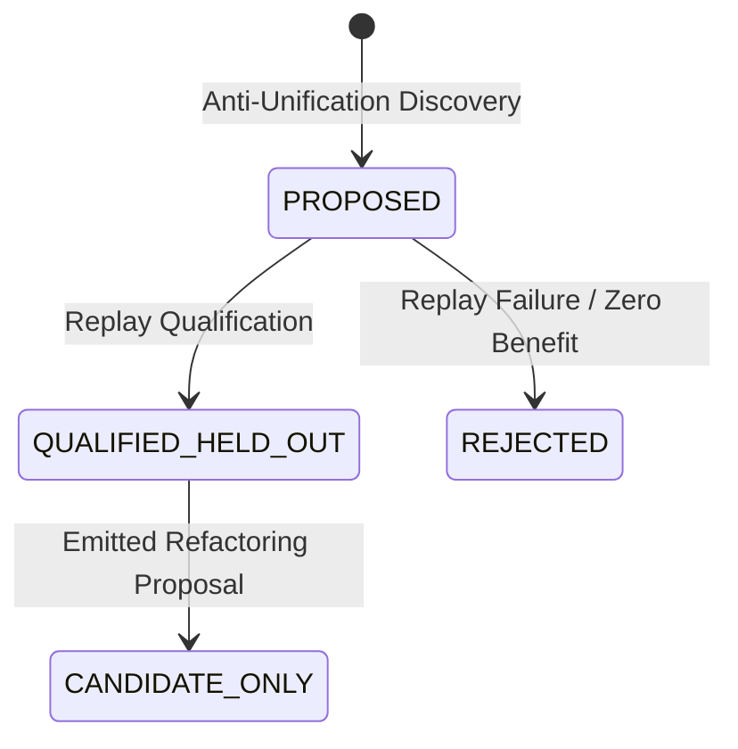

# Automated Abstraction & Anti-Unification Model

**Work Order**: `WO-MATH-FORMAL-DISCOVERY-01A`  
**Module**: `msk-formal-discovery/docs/ABSTRACTION_MODEL.md`

---

## 1. Problem Formulation

Automated abstraction is the algorithmic process of identifying recurring structural reasoning fragments across execution traces and generalizing them into parameterized, reusable components.

The engine requires that abstraction candidates satisfy three criteria:
1. **Syntactic Generalization**: Structural anti-unification must produce a well-formed Least General Generalization (LGG) with verifiable substitution witnesses.
2. **Held-Out Generalization**: The candidate must accelerate problem resolution or compress search representations on strictly disjoint problem instances ($\text{DISCOVERY\_SET} \cap \text{QUALIFICATION\_SET} = \emptyset$).
3. **Multi-Metric Search Benefit**: Proof length compression alone is insufficient. A valid candidate must demonstrate branch pruning, node expansion reduction, or wall-time improvement.

---

## 2. First-Order Term Representation

Reasoning steps, tactic invocations, and expressions are modeled in a typed AST:
- **`Const(name)`**: Named atomic symbols, constants, and operators.
- **`Var(name)`**: Generalization variables ($V_1, V_2, \dots$) bound by substitutions.
- **`App(fn, args)`**: Function applications and composite sequence steps.

Terms support canonical string formatting, variable substitution (`term.substitute(subst)`), and deterministic SHA-256 digesting (`term.digest()`).

---

## 3. Structural Anti-Unification Algorithm

The anti-unifier implements Gordon Plotkin's Least General Generalization (LGG) algorithm extended to multi-trace reasoning sequences:

$$\text{LGG}(t_1, t_2, \dots, t_N)$$

### 3.1 Algorithm Rules
1. **Identical Subterms**: If $t_1 = t_2 = \dots = t_N$, return $t_1$.
2. **Matching Application Heads**: If all $t_i = f(u_{i,1}, \dots, u_{i,k})$, return:
   $$f\left(\text{LGG}(u_{1,1}, \dots, u_{N,1}), \dots, \text{LGG}(u_{1,k}, \dots, u_{N,k})\right)$$
3. **Repeated Difference Pairs**: If the tuple of subterms $(t_1, \dots, t_N)$ has already been observed in the current derivation, reuse the existing variable $V_j$.
4. **Variable Allocation**: Otherwise, allocate a deterministic fresh variable $V_{m+1}$ and record the substitution witness:
   $$\sigma_i(V_{m+1}) = t_i \quad \forall i \in \{1, \dots, N\}$$

### 3.2 Reconstruction Invariant
Before any candidate is emitted, the engine verifies the reconstruction identity:
$$\text{LGG}(t_1, \dots, t_N)\sigma_i = t_i \quad \forall i \in \{1, \dots, N\}$$
Failure to reconstruct raises `AntiUnificationError`.

---

## 4. Subtrace Mining

The [`SubtraceMiner`](file:///home/kowen9024/repos/msk-formal-discovery/src/msk_formal_discovery/abstraction/subtrace_miner.py) discovers recurring n-gram sequences:
1. Slices successful proof paths via `TraceNormalizer.slice_successful_path`.
2. Strips lifecycle framing events (`INITIAL_PROBLEM`, `TERMINAL_VERDICT`, `RESOURCE_OBSERVATION`).
3. Extracts contiguous operation sub-sequences of length $L \in [\text{min\_length}, \text{min\_length} + 4]$.
4. Evaluates support across distinct trace IDs. Subtraces appearing in $\ge \text{min\_support}$ distinct traces are fed to the anti-unifier.

---

## 5. Multi-Metric Prospective Value Evaluation

A shorter proof text alone is insufficient to qualify a candidate lemma. The [`HeldOutReplayEngine`](file:///home/kowen9024/repos/msk-formal-discovery/src/msk_formal_discovery/abstraction/replay.py) measures performance across 8 dimensions:

1. **Supporting Trace Count**: Number of distinct problems where the pattern was discovered.
2. **Structural Compression Ratio**:
   $$\text{Compression} = \frac{\sum \text{Baseline Nodes Expanded}}{\sum \text{Abstracted Nodes Expanded}}$$
3. **Proof Branch Reduction**: Mean branch reductions achieved on qualification problems.
4. **Candidate Evaluation Reduction**: Fractional decrease in evaluated exploration states.
5. **Held-Out Success Rate Delta**: Change in problem solve rate ($\ge 0$).
6. **Wall-Time Delta**: Percentage improvement in solver execution duration.
7. **Instance Portability**: Fraction of held-out instances benefiting from the abstraction.
8. **Human Inspectable Representation Size**: AST size of the generated specification.

---

## 6. Candidate Lifecycle & Non-Authoritative Refactoring

- **`PROPOSED`**: Discovered from traces, pending held-out replay.
- **`QUALIFIED_HELD_OUT`**: Successfully evaluated on held-out traces with measured reduction.
- **Refactoring Proposal**: Emits [`RefactoringProposal`](file:///home/kowen9024/repos/msk-formal-discovery/src/msk_formal_discovery/refactoring/proposal.py) specifying:
  - `before_state` vs `proposed_after_state`
  - Required proof obligations
  - Strict invariant: `canonical_library_mutated = False`
  - Strict invariant: `authority = "NONE"`
