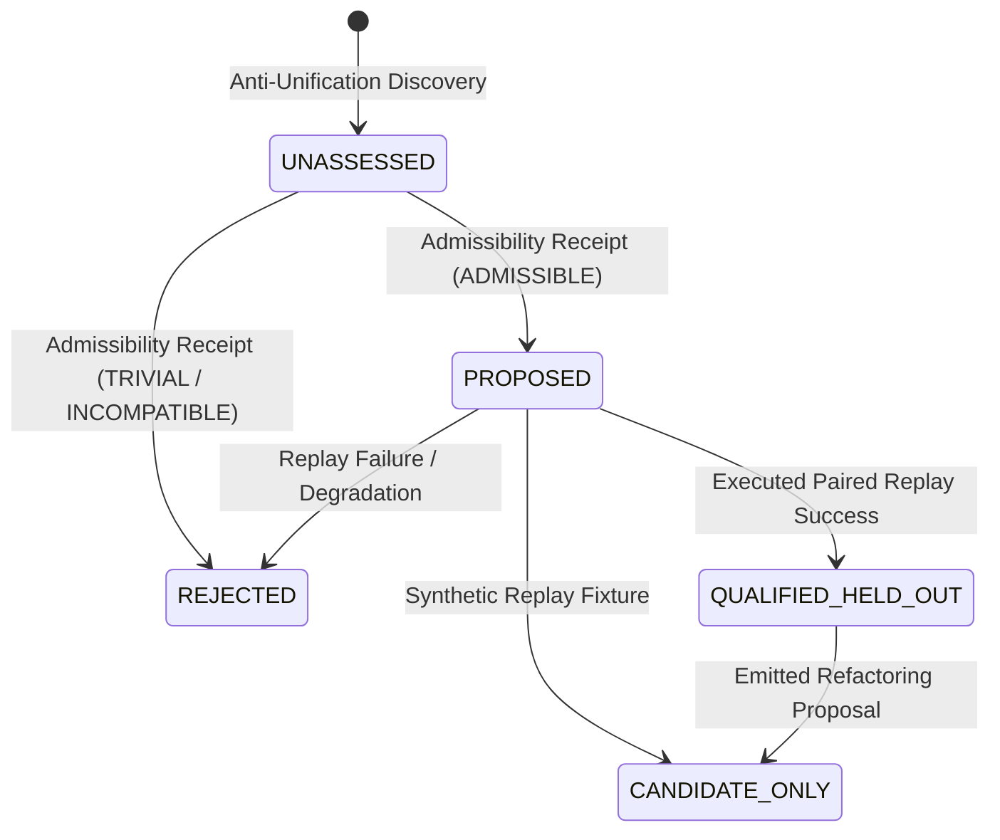

# Automated Abstraction & Anti-Unification Model

**Work Order**: `WO-MATH-FORMAL-DISCOVERY-01A-R2`
**Module**: `msk-formal-discovery/docs/ABSTRACTION_MODEL.md`

---

## 1. Problem Formulation

Automated abstraction is the algorithmic process of identifying recurring structural reasoning fragments across execution traces and generalizing them into parameterized, reusable components.

The engine requires that abstraction candidates satisfy three criteria:
1. **Syntactic Generalization**: Structural anti-unification must produce a well-formed Least General Generalization (LGG) with verifiable substitution witnesses and pass all admissibility guards.
2. **Held-Out Generalization**: The candidate must accelerate problem resolution or compress search representations on strictly disjoint problem instances ($\text{DISCOVERY\_PROBLEM\_DIGESTS} \cap \text{QUALIFICATION\_PROBLEM\_DIGESTS} = \emptyset$).
3. **Multi-Metric Measured Benefit**: Proof length compression alone is insufficient. A valid candidate must demonstrate observed branch pruning, node expansion reduction, or wall-time improvement under real paired replay.

---

## 2. Term Representation Terminology & Type Status

> [!IMPORTANT]
> **IR Typing Status: `UNTYPED FIRST_ORDER_STRUCTURAL_AST`**
> Current Term IR is strictly an **untyped first-order structural abstract syntax tree**. It does **not** implement:
> - Higher-Order Logic (HOL)
> - Dependent Type Theory (DTT)
> - Lambda Calculus with Subtyping
>
> Symbol names and application heads encode tree structure and syntactic arity without intrinsic logical typing. Type safety and domain semantics are enforced externally through admissibility guards and backend execution checkers.

Reasoning steps, tactic invocations, and expressions are modeled in the first-order AST:
- **`Const(name)`**: Named atomic symbols, constants, and operators.
- **`Var(name)`**: Generalization variables ($V_1, V_2, \dots$) bound by substitutions.
- **`App(fn, args)`**: Function applications and composite sequence steps.

Terms support canonical string formatting, variable substitution (`term.substitute(subst)`), and deterministic SHA-256 digesting (`term.digest()`).

---

## 3. Structural Anti-Unification Algorithm

The anti-unifier implements Gordon Plotkin's Least General Generalization (LGG) algorithm extended to multi-trace reasoning sequences:

$$\text{LGG}(t_1, t_2, \dots, t_N)$$

### 3.1 Algorithm Rules
1. **Identical Subterms**: If $t_1 = t_2 = \dots = t_N$, return $t_1$.
2. **Matching Application Heads**: If all $t_i = f(u_{i,1}, \dots, u_{i,k})$, return:
   $$f\left(\text{LGG}(u_{1,1}, \dots, u_{N,1}), \dots, \text{LGG}(u_{1,k}, \dots, u_{N,k})\right)$$
3. **Repeated Difference Pairs**: If the tuple of subterms $(t_1, \dots, t_N)$ has already been observed in the current derivation, reuse the existing variable $V_j$.
4. **Variable Allocation**: Otherwise, allocate a deterministic fresh variable $V_{m+1}$ and record the substitution witness:
   $$\sigma_i(V_{m+1}) = t_i \quad \forall i \in \{1, \dots, N\}$$

### 3.2 Reconstruction Invariant
Before any candidate is emitted, the engine verifies the reconstruction identity:
$$\text{LGG}(t_1, \dots, t_N)\sigma_i = t_i \quad \forall i \in \{1, \dots, N\}$$
Failure to reconstruct raises `AntiUnificationError`.

### 3.3 Admissibility Evaluation & Guards

Every newly generated candidate defaults to:
$$\text{admissibility\_status} \equiv \text{"UNASSESSED"}$$

Admissibility must be formally evaluated, generating an attested [`AdmissibilityReceipt`](file:///home/kowen9024/repos/msk-formal-discovery/src/msk_formal_discovery/abstraction/anti_unification.py). Candidates with `UNASSESSED` admissibility are prohibited from held-out qualification.

The kernel evaluates terms against strict structural guards:
1. **Trivial Variable Guard (`STRUCTURAL_GENERALIZATION_TRIVIAL`)**:
   If the computed LGG term collapses to a bare variable $\text{Var}(V)$, all structural information has been lost. Such terms are rejected (`is_trivial_variable = True`).
2. **Vacuous Wrapper Guard**:
   Wrapper-only terms like `seq(V1)` or `sequence(V1)` possessing zero non-wrapper meaningful constructors are rejected as trivial generalization.
3. **Semantic Domain Incompatibility Guard (`TRIVIAL_OR_SEMANTICALLY_INCOMPATIBLE_GENERALIZATION`)**:
   Generalizations crossing incompatible mathematical domains (e.g. integer addition `int_plus` with boolean XOR `bool_xor`) are rejected as mathematically un-typed and non-generalizable.
4. **Branch-Local Pattern Guard (`REQUIRES_BRANCH_GUARD`)**:
   Patterns discovered within specific branching contexts cannot be exported globally without explicit branch precondition guards.
5. **Non-Globalizable Patterns (`NON_GLOBALIZABLE`)**:
   Patterns tied to contradictory premise sets cannot be ratcheted into global lemma repositories.

---

## 4. Subtrace Mining

The [`SubtraceMiner`](file:///home/kowen9024/repos/msk-formal-discovery/src/msk_formal_discovery/abstraction/subtrace_miner.py) discovers recurring n-gram sequences:
1. Slices successful proof paths via `TraceNormalizer.slice_successful_path`.
2. Strips lifecycle framing events (`INITIAL_PROBLEM`, `TERMINAL_VERDICT`, `RESOURCE_OBSERVATION`).
3. **Excludes Caller Tactics**: Events tagged with `event_origin == EventOrigin.CLIENT_DECLARED` are strictly excluded from mining. Only `BACKEND_OBSERVED` events are eligible for abstraction.
4. Extracts contiguous operation sub-sequences of length $L \in [\text{min\_length}, \text{min\_length} + 4]$.
5. Evaluates support across distinct trace IDs and canonical `problem_digests`. Subtraces appearing in $\ge \text{min\_support}$ distinct traces are fed to the anti-unifier.

---

## 5. De-Fabricated Held-Out Replay & Paired Contracts

### 5.1 Prohibition of Fabricated Benefit Formulas
Predetermined improvement formulas (`baseline * 0.7`) are strictly prohibited. All qualification metrics must be **empirically observed** from search execution receipts or explicitly marked synthetic.

### 5.2 Paired Replay Contract & Cryptographic Binding
For every held-out problem instance, a [`PairedReplayContract`](file:///home/kowen9024/repos/msk-formal-discovery/src/msk_formal_discovery/abstraction/replay.py) binds identical execution variables:
- Canonical `problem_digest`
- Identical backend ID and version
- Identical search policy kind and budget
- Identical random seed (for stochastic policies like MCTS)
- Identical corpus context

The contract computes a SHA-256 `contract_digest` enforcing:
$$\text{ALL NON-ABSTRACTION VARIABLES IDENTICAL}$$
Any configuration drift between baseline and abstracted arms raises `PairedReplayViolationError`.

### 5.3 Replay Run Receipts & Schema Validation
Replay runs produce attested receipts validating against [`schemas/replay-run-receipt.v0.1.schema.json`](file:///home/kowen9024/repos/msk-formal-discovery/schemas/replay-run-receipt.v0.1.schema.json). Receipts verify:
- Exact contract digest match
- Consistency between search run metrics and receipt metrics
- Disjointness between discovery problem digests and qualification problem digests

### 5.4 Replay Modes & Qualification Gating

1. **`SYNTHETIC_REPLAY_FIXTURE`**:
   - Uses fixture data or synthetic runs.
   - Authority is strictly `NONE`.
   - **Cannot** qualify candidate into `QUALIFIED_HELD_OUT` (leaves status at `CANDIDATE_ONLY`).
   - Cannot establish functional search benefit.
2. **`EXECUTED_SEARCH_RUN` / `CERTIFIED_SEARCH_REPLAY`**:
   - Genuinely executes search across held-out instances under paired replay contracts.
   - Evaluates observed compression ratio, evaluation reduction, and branch reduction.
   - Only this mode may promote candidate to `QUALIFIED_HELD_OUT`.

---

## 6. Candidate Lifecycle & Non-Authoritative Refactoring

- **`UNASSESSED`**: Default initial state upon pattern discovery.
- **`PROPOSED`**: Formally assessed as admissible, pending held-out replay.
- **`QUALIFIED_HELD_OUT`**: Successfully evaluated on held-out traces with genuine observed search reduction.
- **`CANDIDATE_ONLY`**: Evaluated under synthetic fixture or retained as non-qualified artifact.
- **`REJECTED`**: Fails admissibility guards, degrades solve rate, or shows negative benefit.
- **Refactoring Proposal**: Emits [`RefactoringProposal`](file:///home/kowen9024/repos/msk-formal-discovery/src/msk_formal_discovery/refactoring/proposal.py) specifying:
  - `before_state` vs `proposed_after_state`
  - Required proof obligations
  - Strict invariant: `canonical_library_mutated = False`
  - Strict invariant: `authority = "NONE"`
