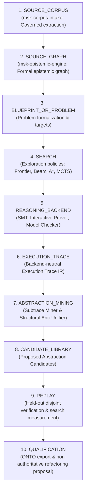

# Architecture & Pipeline Specification

**Work Order**: `WO-MATH-FORMAL-DISCOVERY-01A-R3`
**Module**: `msk-formal-discovery/docs/ARCHITECTURE.md`
**Historical 01A Predecessor**: `8d80e82d5936fb0df36afc95ff7bffb7d4915768` (`FORMAL_DISCOVERY_PROTOTYPE_SPINE_ESTABLISHED`)
**R1 Head**: `96587f8fa379aa972922b7f5e689728e36238f50`
**R2 Head**: `5a641eee2022d8ba54b20aef8708c6b380f3f987`
**Final Disposition**: `FORMAL_DISCOVERY_SPINE_ACCEPTED`

---

## Historical Disposition & R3 Closure Record

Under `WO-MATH-FORMAL-DISCOVERY-01A-R3`, the final evidence-custody seam has been sealed, elevating the formal discovery spine to final acceptance:
1. **Search-Execution Provenance Seal**: Implemented [`SearchExecutionReceipt`](file:///home/kowen9024/repos/msk-formal-discovery/schemas/search-execution-receipt.v0.1.schema.json) certifying problem, policy, environment, backend, and trace bindings with strict terminal status and wall time validation.
2. **Digest-Complete Paired Experiments**: [`PairedReplayContract`](file:///home/kowen9024/repos/msk-formal-discovery/src/msk_formal_discovery/abstraction/replay.py) binds exact 64-char lowercase hex digests for environment, backend, source-graph, and search policy, enforcing strict arm parity and contract digest recomputation.
3. **Backend Receipt Canonicalization**: Execution traces embed and validate backend execution receipts against schema, enforcing binary version match and input digest consistency. SMT/Z3 adapter structurally parses `unknown` verdicts.
4. **Discovery-Origin Custody**: Abstraction candidates and replay engines track `discovery_origin` and `qualification_problem_ids`; synthetic fixtures and client-declared hints cannot qualify non-synthetic discoveries.
5. **Admissibility Evidence Validation**: Structural anti-unifier issues attested [`AdmissibilityReceipt`](file:///home/kowen9024/repos/msk-formal-discovery/schemas/admissibility-receipt.v0.1.schema.json) with deterministic LGG and term digest recomputation, rejecting vacuous wrapper generalizations.
6. **ONTO Evidence Closure**: Prohibits naked booleans and validates structured `OntoEvidenceRef` artifacts against a verified evidence registry.
7. **Comprehensive Hostile Verification**: 99 test cases spanning 19 hostile invariant suites and positive hostile controls pass with 0 failures under `CLAIM CEILING: NONE` and `CANONICAL LIBRARY MUTATION: PROHIBITED`.

The earned disposition is:
$$\text{FORMAL\_DISCOVERY\_SPINE\_ACCEPTED}$$

---

## 1. Architectural Philosophy

Traditional automated theorem proving tools treat verification as an isolated, memoryless task:
$$\text{Input Problem} \xrightarrow{\quad\text{Solve}\quad} \{\text{SUCCESS}, \text{FAIL}\}$$

The Miskatonic Formal Discovery Architecture establishes an iterative, cumulative execution layer. Reasoning traces are retained, parsed into typed AST structures (`UNTYPED FIRST_ORDER_STRUCTURAL_AST`), mined for recurring subtraces, generalized via Least General Generalization (LGG), and evaluated prospectively against held-out instances to compress the mathematical search space over time.

---

## 2. Frozen 10-Stage Pipeline Progression

The architectural pipeline is strictly ordered and frozen across 10 stages:

Sequence violations (such as skipping search, out-of-order execution, or promoting candidates without held-out replay) are prevented by `verify_pipeline_sequence` and strict schema invariants.

---

## 3. Subsystem Component Boundaries

### 3.1 Corpus & Graph Upstreams
- **`msk-corpus-intake`**: Supplies governed primary manuscript extractions, verbatim formal code snippets, and bibliographic locators without making conjectural claims.
- **`msk-epistemic-engine`**: Constructs epistemic dependency graphs, entity mappings, and retrieval priors used as non-authoritative heuristic guidance.

### 3.2 Reasoning Backend Execution Layer
- **Contract Interface**: [`ReasoningBackend`](file:///home/kowen9024/repos/msk-formal-discovery/src/msk_formal_discovery/backend/contract.py) provides a provider-neutral interface for problem dispatch, goal tracking, and trace emission.
- **Authority Enforcement**: Backends are strictly partitioned into Logical Authority Classes. An SMT solver cannot emit deductive proof claims, and model checkers cannot be labeled as interactive theorem provers. All authority derivation MUST go through `derive_authority(...)`.
- **Execution Receipts**: Real backend executions emit attested [`BackendExecutionReceipt`](file:///home/kowen9024/repos/msk-formal-discovery/schemas/backend-execution-receipt.v0.1.schema.json) records binding executable path, sha256 digest, command invocation, source input digest, stdout/stderr digests, exit code, and timeout status. Traces validate backend execution receipts against schema upon construction and cross-check backend version and input digests.
- **Structural Verdict Parsing**: SMT/Z3 adapter parses `sat`, `unsat`, and `unknown` verdicts deterministically.
- **Synthetic Fixture Boundary**: Simulated and synthetic fixture modes always emit authority `NONE` and `proof_complete: NOT_ESTABLISHED`.
- **Backend Qualification Status**:
  - `LEAN_CHECKER_VERDICT_EXECUTION: QUALIFIED` (Executable verified locally)
  - `LEAN_PROOF_STEP_TRACE_EXTRACTION: NOT_YET_QUALIFIED`
  - `ROCQ_CHECKER_VERDICT_EXECUTION: NOT_QUALIFIED` (Fail-closed due to environment absence)
  - `ROCQ_PROOF_STEP_TRACE_EXTRACTION: NOT_YET_QUALIFIED`

### 3.3 Execution Trace IR & Normalization
- **Trace IR**: [`ExecutionTrace`](file:///home/kowen9024/repos/msk-formal-discovery/src/msk_formal_discovery/trace/ir.py) records discrete, typed events in a monotonic directed acyclic graph, explicitly typed with `execution_origin` (`EXECUTED_NATIVE`, `EXECUTED_CONTAINERIZED`, `CERTIFIED_REPLAY`, `SYNTHETIC_FIXTURE`, `SIMULATED`) and canonical `problem_digest`.
- **Event Origins**: Events explicitly distinguish between:
  - `CLIENT_DECLARED`: Caller-supplied hypotheses, tactics, or search hints.
  - `BACKEND_OBSERVED`: Structural verdicts and state assertions observed directly from the backend.
  Events with `CLIENT_DECLARED` or `SYNTHETIC_FIXTURE` origin attempting to carry non-NONE authority trigger immediate `AuthorityViolationError`.
- **Normalizer**: [`TraceNormalizer`](file:///home/kowen9024/repos/msk-formal-discovery/src/msk_formal_discovery/trace/normalizer.py) backtracks through parent event pointers to extract the minimal successful spine, stripping speculative failures, aborted branches, and lifecycle bookends.

### 3.4 Search Policies & Guidance Interface
- **Policy Contract**: [`SearchPolicy`](file:///home/kowen9024/repos/msk-formal-discovery/src/msk_formal_discovery/search/policy.py) defines deterministic action proposal and candidate state selection.
- **Search Execution Receipts**: Real search runs executed via [`SearchExecutor`](file:///home/kowen9024/repos/msk-formal-discovery/src/msk_formal_discovery/search/executor.py) emit attested [`SearchExecutionReceipt`](file:///home/kowen9024/repos/msk-formal-discovery/schemas/search-execution-receipt.v0.1.schema.json) certifying problem, policy, environment, backend, trace bindings, terminal status, and wall time.
- **Corpus-Guided MCTS**: Heuristic retrieval priors shape tree expansion probabilities without granting proof truth:
  $$\text{Search Policy Authority} \equiv \text{NONE}$$
- **MCTS Capability Boundary**: Rollout evaluation is labeled `SYNTHETIC_PRIOR_ROLLOUT` and carries no formal proof authority.
- **Canonical Unit Identity**: Every `SearchRun` binds canonical 64-char lowercase hex `problem_digest`.

### 3.5 Abstraction Engine
- **Subtrace Miner**: Discovers repeated operation patterns appearing with sufficient support across distinct problem traces. Caller-provided `CLIENT_DECLARED` events are strictly excluded from abstraction mining (`synthetic_algorithm_test_mode=False`).
- **Structural Anti-Unifier**: Computes the first-order Least General Generalization (LGG) and records deterministic substitution witnesses reconstructing each input term.
- **Discovery Origin Tracking**: Candidates track `discovery_origin` (`EXECUTED_SEARCH_MINING`, `CLIENT_DECLARED_MINING`, `SYNTHETIC_FIXTURE`) and `qualification_problem_ids`.
- **Admissibility Evaluation**: Candidates default to `admissibility_status: "UNASSESSED"`. Admissibility is formally evaluated via an [`AdmissibilityReceipt`](file:///home/kowen9024/repos/msk-formal-discovery/schemas/admissibility-receipt.v0.1.schema.json) with deterministic recomputation of LGG and term digests. Guards reject:
  - Bare single-variable generalizations (`STRUCTURAL_GENERALIZATION_TRIVIAL`)
  - Vacuous wrapper applications such as `seq(V1)` with no meaningful constructor structure
  - Semantically incompatible operations (`TRIVIAL_OR_SEMANTICALLY_INCOMPATIBLE_GENERALIZATION`)
  - Branch-local patterns without guards (`REQUIRES_BRANCH_GUARD`)

### 3.6 Replay & Qualification Engine
- **Disjointness Guard**: Verifies canonical experimental unit separation:
  $$\text{DISCOVERY\_PROBLEM\_DIGESTS} \cap \text{QUALIFICATION\_PROBLEM\_DIGESTS} = \emptyset$$
- **Paired Replay Contract**: [`PairedReplayContract`](file:///home/kowen9024/repos/msk-formal-discovery/src/msk_formal_discovery/abstraction/replay.py) binds all non-abstraction variables (environment_digest, backend_digest, source_graph_digest, search_policy_digest, problem_digest, budget, seed) identical between baseline and abstracted arms, verified via cryptographic `contract_digest`.
- **Receipt Validation & Cross-Checking**: Replay run receipts validate against [`ReplayRunReceipt`](file:///home/kowen9024/repos/msk-formal-discovery/schemas/replay-run-receipt.v0.1.schema.json) and cross-check against underlying [`SearchExecutionReceipt`](file:///home/kowen9024/repos/msk-formal-discovery/schemas/search-execution-receipt.v0.1.schema.json) records.
- **De-Fabricated Benefit**: Qualification requires genuine observed search reduction from `EXECUTED_SEARCH_RUN` or `CERTIFIED_SEARCH_REPLAY`. `SYNTHETIC_REPLAY_FIXTURE` leaves candidates at `CANDIDATE_ONLY`.
- **Lifecycle Ratchet**: Candidates transition from `PROPOSED` to `QUALIFIED_HELD_OUT` only after passing empirical replay thresholds under executed paired replay with `admissibility_status == "ADMISSIBLE"` and non-synthetic discovery origin.

### 3.7 Downstream Integration
- **`msk-onto`**: Receives structural evaluation export packages ([`OntoEvaluationPackage`](file:///home/kowen9024/repos/msk-formal-discovery/src/msk_formal_discovery/onto/export.py)). Naked booleans and unsupported positive claims are prohibited (`NAKED_BOOLEAN_PROHIBITED`); all positive claims require structured [`OntoEvidenceRef`](file:///home/kowen9024/repos/msk-formal-discovery/src/msk_formal_discovery/onto/export.py) validated against a resolvable evidence registry.
- **Refactoring Proposals**: Emits human-inspectable refactoring proposals ([`RefactoringProposal`](file:///home/kowen9024/repos/msk-formal-discovery/src/msk_formal_discovery/refactoring/proposal.py)) while strictly maintaining `canonical_library_mutated = False`.

---

## 4. Authority Firewall Matrix

| Component / Mode | Permitted Authority Class | Prohibited Claims |
| :--- | :--- | :--- |
| **Search Policy (MCTS/Beam/A\*)** | `NONE` | Deductive truth, corpus validity |
| **Corpus Guidance Interface** | `NONE` | Proof authority, truth certification |
| **Synthetic Fixture / Simulation** | `NONE` | Proof authority, solver SAT/UNSAT |
| **SMT Solver (Executed Native)** | `SOLVER_SAT_OR_UNSAT` | `DEDUCTIVE_PROOF_AUTHORITY` |
| **Model Checker (TLA+/Alloy)** | `BOUNDED_EXHAUSTIVE_VERDICT` | Unbounded theorem truth |
| **Interactive Prover (Executed Native)** | `DEDUCTIVE_PROOF_AUTHORITY` | Empirical approximation |
| **Synthetic Replay Fixture** | `NONE` | `QUALIFIED_HELD_OUT` status promotion |
| **Abstraction Candidate** | `NONE` | Accepted canonical library lemma |
| **Refactoring Proposal** | `NONE` | Canonical mutation (`mutated=false`) |
