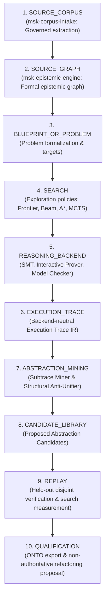

# Architecture & Pipeline Specification

**Work Order**: `WO-MATH-FORMAL-DISCOVERY-01A`  
**Module**: `msk-formal-discovery/docs/ARCHITECTURE.md`

---

## 1. Architectural Philosophy

Traditional automated theorem proving tools treat verification as an isolated, memoryless task:
$$\text{Input Problem} \xrightarrow{\quad\text{Solve}\quad} \{\text{SUCCESS}, \text{FAIL}\}$$

The Miskatonic Formal Discovery Architecture establishes an iterative, cumulative execution layer. Reasoning traces are retained, parsed into typed AST structures, mined for recurring subtraces, generalized via Least General Generalization (LGG), and evaluated prospectively against held-out instances to compress the mathematical search space over time.

---

## 2. Frozen 10-Stage Pipeline Progression

The architectural pipeline is strictly ordered and frozen across 10 stages:

Sequence violations (such as skipping search, out-of-order execution, or promoting candidates without held-out replay) are prevented by `verify_pipeline_sequence` and strict schema invariants.

---

## 3. Subsystem Component Boundaries

### 3.1 Corpus & Graph Upstreams
- **`msk-corpus-intake`**: Supplies governed primary manuscript extractions, verbatim formal code snippets, and bibliographic locators without making conjectural claims.
- **`msk-epistemic-engine`**: Constructs epistemic dependency graphs, entity mappings, and retrieval priors used as non-authoritative heuristic guidance.

### 3.2 Reasoning Backend Execution Layer
- **Contract Interface**: [`ReasoningBackend`](file:///home/kowen9024/repos/msk-formal-discovery/src/msk_formal_discovery/backend/contract.py) provides a provider-neutral interface for problem dispatch, goal tracking, and trace emission.
- **Authority Enforcement**: Backends are strictly partitioned into Logical Authority Classes. An SMT solver cannot emit deductive proof claims, and model checkers cannot be labeled as interactive theorem provers.

### 3.3 Execution Trace IR & Normalization
- **Trace IR**: [`ExecutionTrace`](file:///home/kowen9024/repos/msk-formal-discovery/src/msk_formal_discovery/trace/ir.py) records discrete, typed events in a monotonic directed acyclic graph.
- **Normalizer**: [`TraceNormalizer`](file:///home/kowen9024/repos/msk-formal-discovery/src/msk_formal_discovery/trace/normalizer.py) backtracks through parent event pointers to extract the minimal successful spine, stripping speculative failures, aborted branches, and lifecycle bookends.

### 3.4 Search Policies & Guidance Interface
- **Policy Contract**: [`SearchPolicy`](file:///home/kowen9024/repos/msk-formal-discovery/src/msk_formal_discovery/search/policy.py) defines deterministic action proposal and candidate state selection.
- **Corpus-Guided MCTS**: Heuristic retrieval priors shape tree expansion probabilities without granting proof truth:
  $$\text{Search Policy Authority} \equiv \text{NONE}$$

### 3.5 Abstraction Engine
- **Subtrace Miner**: Discovers repeated operation patterns appearing with sufficient support across distinct problem traces.
- **Structural Anti-Unifier**: Computes the first-order Least General Generalization (LGG) and records deterministic substitution witnesses reconstructing each input term.

### 3.6 Replay & Qualification Engine
- **Disjointness Guard**: Verifies $\text{DISCOVERY\_SET} \cap \text{QUALIFICATION\_SET} = \emptyset$.
- **Multi-Metric Evaluation**: Evaluates prospective benefit across node expansion reduction, branch elimination, compression ratio, and wall-time delta.
- **Lifecycle Ratchet**: Candidates transition from `PROPOSED` to `QUALIFIED_HELD_OUT` only after passing empirical replay thresholds.

### 3.7 Downstream Integration
- **`msk-onto`**: Receives structural evaluation export packages ([`OntoEvaluationPackage`](file:///home/kowen9024/repos/msk-formal-discovery/src/msk_formal_discovery/onto/export.py)) containing representation invariance and recurrence metrics.
- **Refactoring Proposals**: Emits human-inspectable refactoring proposals ([`RefactoringProposal`](file:///home/kowen9024/repos/msk-formal-discovery/src/msk_formal_discovery/refactoring/proposal.py)) while strictly maintaining `canonical_library_mutated = False`.

---

## 4. Authority Firewall Matrix

| Component | Permitted Authority Class | Prohibited Claims |
| :--- | :--- | :--- |
| **Search Policy (MCTS/Beam/A\*)** | `NONE` | Deductive truth, corpus validity |
| **Corpus Guidance Interface** | `NONE` | Proof authority, truth certification |
| **SMT Solver Adapter (Z3/cvc5)** | `SOLVER_SAT_OR_UNSAT` | `DEDUCTIVE_PROOF_AUTHORITY` |
| **Model Checker (TLA+/Alloy)** | `BOUNDED_EXHAUSTIVE_VERDICT` | Unbounded theorem truth |
| **Interactive Prover (Lean4/Rocq)** | `DEDUCTIVE_PROOF_AUTHORITY` | Empirical approximation |
| **Abstraction Candidate** | `NONE` | Accepted canonical library lemma |
| **Refactoring Proposal** | `NONE` | Canonical mutation (`mutated=false`) |
