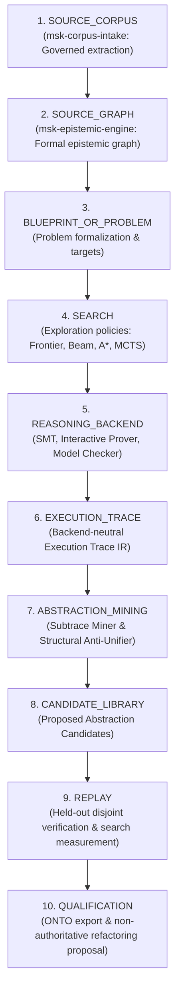

# Architecture & Pipeline Specification

**Work Order**: `WO-MATH-FORMAL-DISCOVERY-01A-R1`  
**Module**: `msk-formal-discovery/docs/ARCHITECTURE.md`  
**Historical 01A Predecessor**: `8d80e82d5936fb0df36afc95ff7bffb7d4915768` (`FORMAL_DISCOVERY_PROTOTYPE_SPINE_ESTABLISHED`)  
**Repaired Disposition**: `FORMAL_DISCOVERY_SPINE_READY`

---

## Historical 01A Disposition Record

Root commit `8d80e82d5936fb0df36afc95ff7bffb7d4915768` established a prototype architecture for formal discovery. However, `FORMAL_DISCOVERY_SPINE_READY` was not yet earned at 01A because backend execution was simulated, solver refutations lacked verified process receipts, and held-out qualification metrics relied on predetermined formulas (`baseline * 0.7`).

The canonical repaired interpretation of `8d80e82` is:
$$\text{FORMAL\_DISCOVERY\_PROTOTYPE\_SPINE\_ESTABLISHED}$$

Under `WO-MATH-FORMAL-DISCOVERY-01A-R1`, all execution-authority firewalls, real backend receipts, paired replay contracts, admissibility guards, and fail-closed evaluation defaults have been implemented and verified across 56 tests, earning:
$$\text{FORMAL\_DISCOVERY\_SPINE\_READY}$$

---

## 1. Architectural Philosophy

Traditional automated theorem proving tools treat verification as an isolated, memoryless task:
$$\text{Input Problem} \xrightarrow{\quad\text{Solve}\quad} \{\text{SUCCESS}, \text{FAIL}\}$$

The Miskatonic Formal Discovery Architecture establishes an iterative, cumulative execution layer. Reasoning traces are retained, parsed into typed AST structures (`UNTYPED FIRST_ORDER_STRUCTURAL_AST`), mined for recurring subtraces, generalized via Least General Generalization (LGG), and evaluated prospectively against held-out instances to compress the mathematical search space over time.

---

## 2. Frozen 10-Stage Pipeline Progression

The architectural pipeline is strictly ordered and frozen across 10 stages:

Sequence violations (such as skipping search, out-of-order execution, or promoting candidates without held-out replay) are prevented by `verify_pipeline_sequence` and strict schema invariants.

---

## 3. Subsystem Component Boundaries

### 3.1 Corpus & Graph Upstreams
- **`msk-corpus-intake`**: Supplies governed primary manuscript extractions, verbatim formal code snippets, and bibliographic locators without making conjectural claims.
- **`msk-epistemic-engine`**: Constructs epistemic dependency graphs, entity mappings, and retrieval priors used as non-authoritative heuristic guidance.

### 3.2 Reasoning Backend Execution Layer
- **Contract Interface**: [`ReasoningBackend`](file:///home/kowen9024/repos/msk-formal-discovery/src/msk_formal_discovery/backend/contract.py) provides a provider-neutral interface for problem dispatch, goal tracking, and trace emission.
- **Authority Enforcement**: Backends are strictly partitioned into Logical Authority Classes. An SMT solver cannot emit deductive proof claims, and model checkers cannot be labeled as interactive theorem provers.
- **Execution Receipts**: Real backend executions emit attested [`BackendExecutionReceipt`](file:///home/kowen9024/repos/msk-formal-discovery/schemas/backend-execution-receipt.v0.1.schema.json) records binding executable path, sha256 digest, command invocation, source input digest, stdout/stderr digests, exit code, and timeout status.
- **Synthetic Fixture Boundary**: Simulated and synthetic fixture modes always emit authority `NONE` and `proof_complete: NOT_ESTABLISHED`.

### 3.3 Execution Trace IR & Normalization
- **Trace IR**: [`ExecutionTrace`](file:///home/kowen9024/repos/msk-formal-discovery/src/msk_formal_discovery/trace/ir.py) records discrete, typed events in a monotonic directed acyclic graph, explicitly typed with `execution_origin` (`EXECUTED_NATIVE`, `EXECUTED_CONTAINERIZED`, `CERTIFIED_REPLAY`, `SYNTHETIC_FIXTURE`, `SIMULATED`).
- **Normalizer**: [`TraceNormalizer`](file:///home/kowen9024/repos/msk-formal-discovery/src/msk_formal_discovery/trace/normalizer.py) backtracks through parent event pointers to extract the minimal successful spine, stripping speculative failures, aborted branches, and lifecycle bookends.

### 3.4 Search Policies & Guidance Interface
- **Policy Contract**: [`SearchPolicy`](file:///home/kowen9024/repos/msk-formal-discovery/src/msk_formal_discovery/search/policy.py) defines deterministic action proposal and candidate state selection.
- **Corpus-Guided MCTS**: Heuristic retrieval priors shape tree expansion probabilities without granting proof truth:
  $$\text{Search Policy Authority} \equiv \text{NONE}$$
- **MCTS Capability Boundary**: Rollout evaluation is labeled `SYNTHETIC_PRIOR_ROLLOUT` and carries no formal proof authority.

### 3.5 Abstraction Engine
- **Subtrace Miner**: Discovers repeated operation patterns appearing with sufficient support across distinct problem traces.
- **Structural Anti-Unifier**: Computes the first-order Least General Generalization (LGG) and records deterministic substitution witnesses reconstructing each input term.
- **Admissibility Guards**: Rejects trivial single-variable generalizations (`STRUCTURAL_GENERALIZATION_TRIVIAL`), semantically incompatible operations (`TRIVIAL_OR_SEMANTICALLY_INCOMPATIBLE_GENERALIZATION`), and guards branch-local patterns (`REQUIRES_BRANCH_GUARD`).

### 3.6 Replay & Qualification Engine
- **Disjointness Guard**: Verifies $\text{DISCOVERY\_SET} \cap \text{QUALIFICATION\_SET} = \emptyset$.
- **Paired Replay Contract**: [`PairedReplayContract`](file:///home/kowen9024/repos/msk-formal-discovery/src/msk_formal_discovery/abstraction/replay.py) binds all non-abstraction variables (backend, problem digest, search budget, random seed, corpus context) identical between baseline and abstracted arms.
- **De-Fabricated Benefit**: Qualification requires genuine observed search reduction from `EXECUTED_HELD_OUT_REPLAY`. `SYNTHETIC_REPLAY_FIXTURE` leaves candidates at `CANDIDATE_ONLY`.
- **Lifecycle Ratchet**: Candidates transition from `PROPOSED` to `QUALIFIED_HELD_OUT` only after passing empirical replay thresholds under executed paired replay.

### 3.7 Downstream Integration
- **`msk-onto`**: Receives structural evaluation export packages ([`OntoEvaluationPackage`](file:///home/kowen9024/repos/msk-formal-discovery/src/msk_formal_discovery/onto/export.py)) containing observed evidence states (`UNKNOWN`/`UNTESTED`) without inventing positive research conclusions.
- **Refactoring Proposals**: Emits human-inspectable refactoring proposals ([`RefactoringProposal`](file:///home/kowen9024/repos/msk-formal-discovery/src/msk_formal_discovery/refactoring/proposal.py)) while strictly maintaining `canonical_library_mutated = False`.

---

## 4. Authority Firewall Matrix

| Component / Mode | Permitted Authority Class | Prohibited Claims |
| :--- | :--- | :--- |
| **Search Policy (MCTS/Beam/A\*)** | `NONE` | Deductive truth, corpus validity |
| **Corpus Guidance Interface** | `NONE` | Proof authority, truth certification |
| **Synthetic Fixture / Simulation** | `NONE` | Proof authority, solver SAT/UNSAT |
| **SMT Solver (Executed Native)** | `SOLVER_SAT_OR_UNSAT` | `DEDUCTIVE_PROOF_AUTHORITY` |
| **Model Checker (TLA+/Alloy)** | `BOUNDED_EXHAUSTIVE_VERDICT` | Unbounded theorem truth |
| **Interactive Prover (Executed Native)** | `DEDUCTIVE_PROOF_AUTHORITY` | Empirical approximation |
| **Synthetic Replay Fixture** | `NONE` | `QUALIFIED_HELD_OUT` status promotion |
| **Abstraction Candidate** | `NONE` | Accepted canonical library lemma |
| **Refactoring Proposal** | `NONE` | Canonical mutation (`mutated=false`) |
